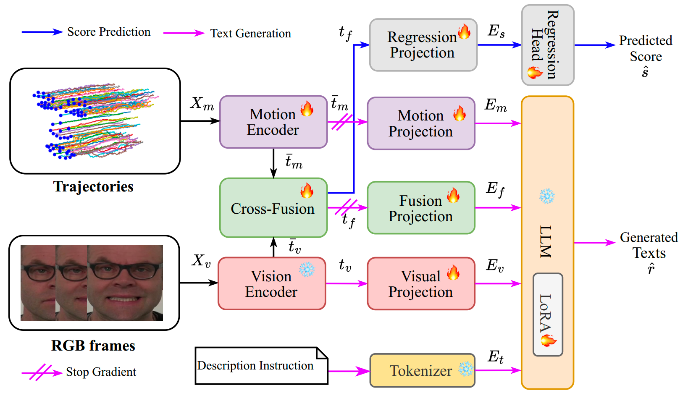

# TraMP-LLaMA
TraMP-LLaMA: Generative Interpretability with Decoupled Instruction Tuning for Facial Expression Quality Assessment
[arXiv version]()

We propose TraMP-LLaMA, a unified multimodal framework that jointly predicts severity scores and generates structured textual reports from facial motion cues. To support this task, we further extend the PFED5 dataset with expert-guided textual motion descriptions and construct PFED5+.



## PFED5+ dataset

1: Please request the access to video frames and MDS-UPDRS labels through this [link](https://github.com/shuchaoduan/QAFE-Net).

2: The motion description labels are provided [here]().

## Citations
If you find our work useful in your research, please consider giving it a star ⭐ and citing our paper in your work:

```
@INPROCEEDINGS{tramp-former,
  title={Trajectory-guided Motion Perception for Facial Expression Quality Assessment in Neurological Disorders},
  author={Shuchao Duan and Amirhossein Dadashzadeh and Alan Whone and Majid Mirmehdi},
  booktitle={2025 IEEE 19th International Conference on Automatic Face and Gesture Recognition (FG)},
  year={2025},
  doi={10.1109/FG61629.2025.11099263}
}
@misc{duan2023qafenet,
      title={QAFE-Net: Quality Assessment of Facial Expressions with Landmark Heatmaps}, 
      author={Shuchao Duan and Amirhossein Dadashzadeh and Alan Whone and Majid Mirmehdi},
      year={2023},
      eprint={2312.00856},
      archivePrefix={arXiv},
      primaryClass={cs.CV}
}
```

## Acknowledgement
